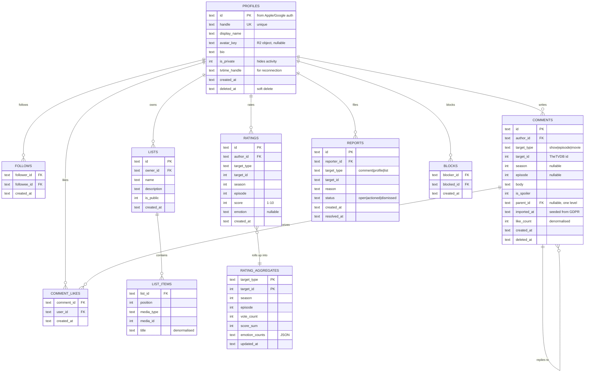

# OpenTV backend — the data layer

Nine tables on Cloudflare D1. The server stores only what is inherently
*shared*; everything a person owns stays on their phone.

---

## The rule the schema obeys

The phone's SQLite database is the source of truth for a user's own library.
The server never becomes authoritative for anything they already own. It holds
comments, ratings, the follow graph, public profile fields and published lists —
the things that only mean something between people.

> **If the server disappeared,** every user would still have their complete watch
> history and the app would still work. They would lose other people's comments
> and ratings. Nothing else.
>
> That is what makes the account genuinely optional rather than
> optional-until-it-matters. It is also why there is no conflict-resolution
> system in here: the two sides never disagree, because they never store the
> same thing.

---

## Diagram

---

## Why each table exists

### profiles — core

Everything else hangs off this. `tvtime_handle` is the interesting column: it
comes from the GDPR import, and it is what lets two people who were friends on
TV Time find each other again. No competitor has that data, because no
competitor imported the file it came from.

### follows — core

A plain edge list. `is_private` lives on the profile rather than per-edge, so a
privacy check is one lookup instead of a permission model.

### comments — core

One thread per show, episode or movie, addressed by **TheTVDB id** so it lines
up with what the app already stores locally — no translation layer between a
comment and the show it belongs to. If the primary catalogue ever changes again,
this is the column that hurts.

Replies are **one level deep**. Deeper threading is a moderation problem wearing
a feature's clothes.

`imported_at` marks a comment seeded from the author's own export, so seeded and
written content stay distinguishable forever.

### rating_aggregates — derived

The percentages are computed when someone **votes**, not when someone **reads**.

This is the table that makes the whole thing run for free. Workers allows
10&nbsp;ms of CPU per request on the free plan; scanning thousands of votes on
every episode view would not fit inside that. Counting once per vote does.
Writes are rare, reads are constant — the schema should reflect that, and
retrofitting it later means a migration under load.

### lists · list_items — core

Only lists a user explicitly publishes. Everything else in their library stays
on the phone. Titles are denormalised onto the item so rendering someone else's
list requires no metadata lookups.

### reports · blocks — legally required

Not optional and not a v2 feature. Apple's guideline 1.2 requires a report path,
a block path, a published EULA, and evidence of acting on reports within 24
hours. Both stores have removed apps for missing these.

---

## What is deliberately absent

- **No watch history.** Episodes watched, progress and dates never leave the
  phone. There is no table for them, which is what makes "the server can vanish"
  structurally true rather than a promise.
- **No images in v1.** Comment images arrive with Plus, behind a CSAM scanner
  that must be wired *before* the first upload — not funded by it.
- **No groups, feeds or match %.** Each doubles the surface area, none is why
  anyone came to OpenTV, and all are easier to design once real comment usage
  exists to look at.
- **No email or password.** Sign in with Apple and Google only: one fewer
  credential to leak, one fewer support burden.
- **Nothing at all for users who decline.** They never contact the server. No
  anonymous telemetry, no exceptions.

---

## What it costs to run

| Installs | In community | Requests/day | Cloudflare plan | Cost/month |
|---|---|---|---|---|
| 10,000 | 3,000 | 15,000 | Free | $0 |
| 67,000 | 20,000 | 100,000 | Free (at the limit) | $0 |
| 100,000 | 30,000 | 150,000 | Paid | $5 |
| 500,000 | 150,000 | 750,000 | Paid | ~$22 |

Assumes **5 requests per user per day** — the app only calls out to search
people, read ratings and open a comment thread; everything else is already on
the phone. Edge-caching the aggregates pushes the free tier several times
further.

The free plan **fails closed**: past 100,000 requests in a day it returns errors
rather than billing you. That is the argument for paying the $5 on launch day —
insurance against a good day, not a sign of outgrowing it.

---

## Open questions, before any of this ships

- [ ] **TheTVDB commercial licence.** The app made TheTVDB primary in 1.2.0. The
      bundled shared key almost certainly does not cover an app selling
      subscriptions. This is the one item that could invalidate the plan.
- [ ] **Privacy policy rewrite.** It currently says there is no server.
- [ ] **Age rating re-review.** User-generated content typically pushes an app
      above the current 13+.
- [ ] **Handle collisions.** Two people can import the same TV Time name. Is the
      imported handle a *claim* (first to sign in wins) or a *suggestion*
      (pre-filled, must be confirmed)? Suggestion is safer — a claim lets someone
      import an export that is not theirs and take the name on it.
